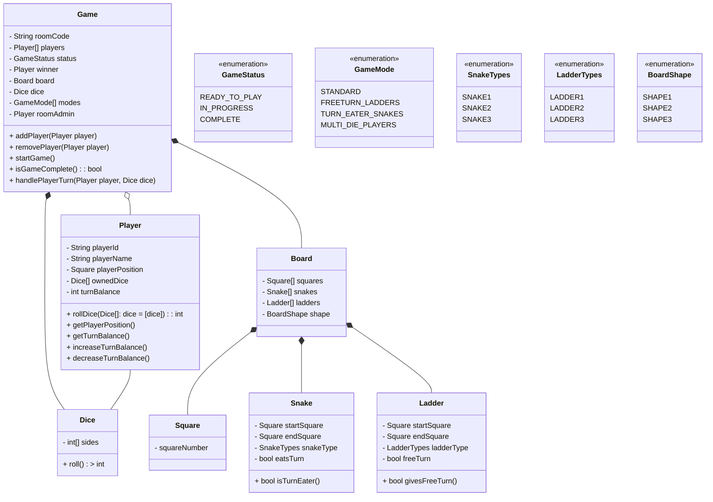
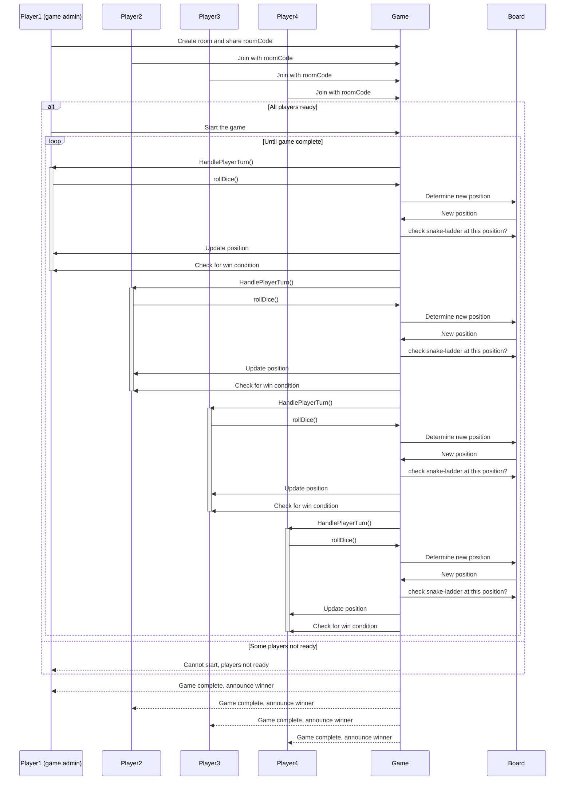

## Problem Statement

### Requirements
Design class diagram for snake and ladders multiplayer game. One of the players creates a room and shares the roomCode with up to 3 of his friends. These friends join the room with the roomCode provided and once all the players are ready, the room creator can start the game. 
	Each of the players have 1 token each. And they start at position 1 on the board and the first one to reach position 100 will win the game. Players will roll an unbiased dice one by one in a predetermined order, the token of the player will be moved ahead by the number with the dice outcome. If the token stops on the start of the ladder then the token moves up to the end of the ladder. Similarly, if the player lands at the face of the snake, then the token moves down to the position where the end of the snake tail lies. First one who reaches the position 100 wins the game.

#### Other points to consider:
1. The board is set up with the snake and ladders using several of the predefined configurations of snakes and ladders.
1. There will be different types of snakes, ladders which appear differently on the board.

#### Future scope
These points are optional points to be considered during the design, these ideas may or may not be implemented by the product in future. 
There can be multiple game modes introduced in future which can have different configurations like
1. Multiple dice to be rolled by player at once as opposed to single dice.
1. Multiple dice to be owned by each player and first one to reach all his/her tokens to 100 wins.
1.  Special type of snake (If you land on it, you will not only go to the end of tail but also lose next turn) and ladder (If you land on it, you will go to the top of the ladder and get an extra turn) can be introduced.
1. Shape of the board can change in new modes but the numbering will continue to be 1 to 100.

#### Expected from candidate
1. Well designed and extensible class diagram of the game with clear indication of fields, functions (their return type, params, access specifiers) and relationship between classes.
1. A write up or a sequence diagram for the important flows of the game.

## Class Diagram

## Sequence Diagram

